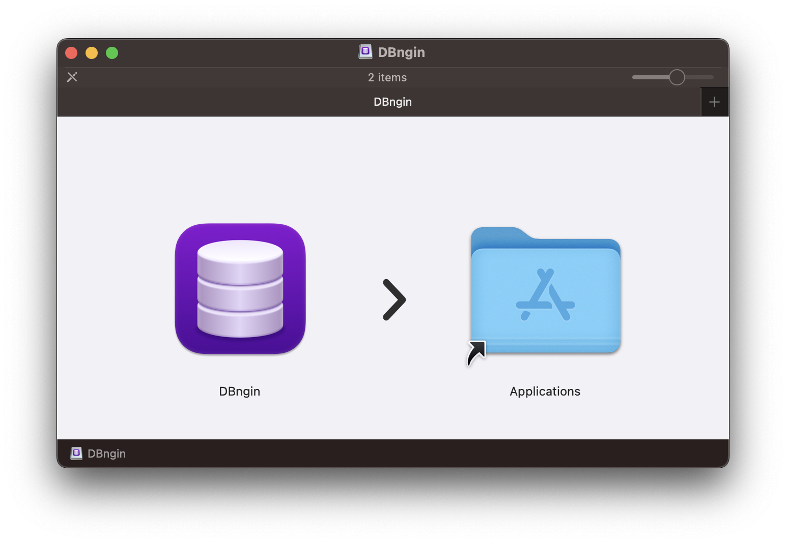
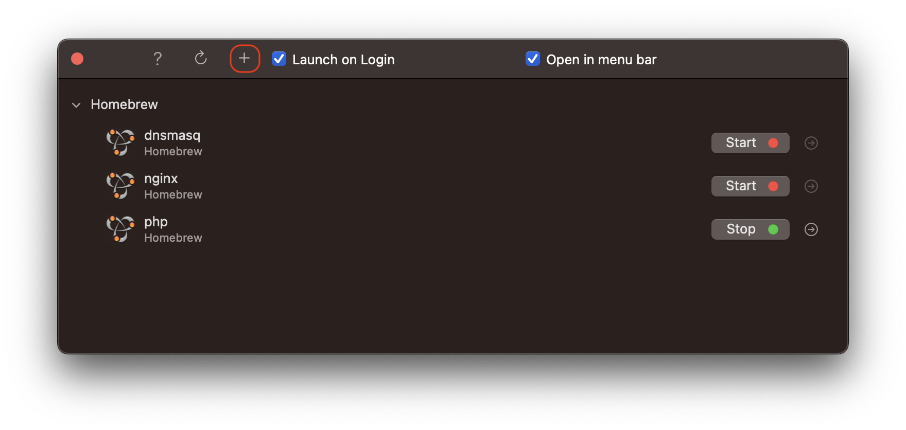
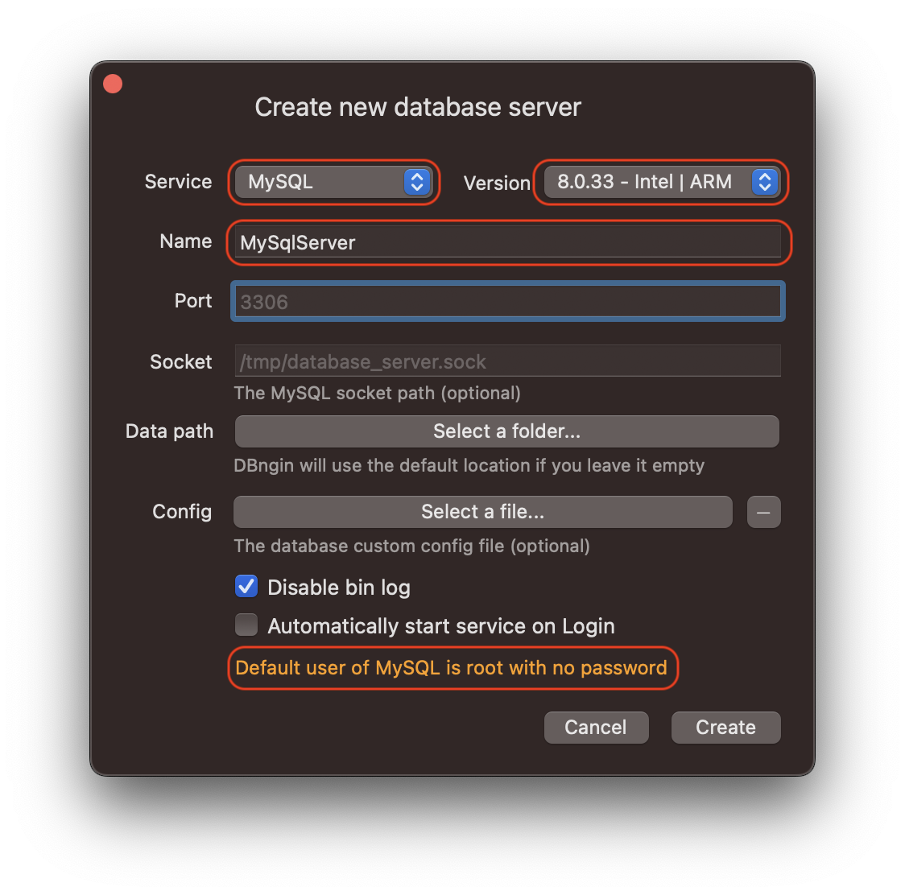
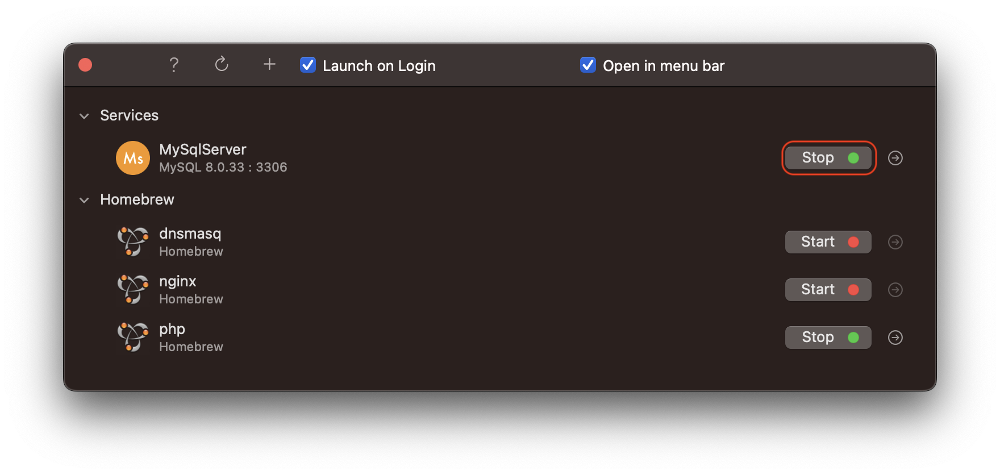
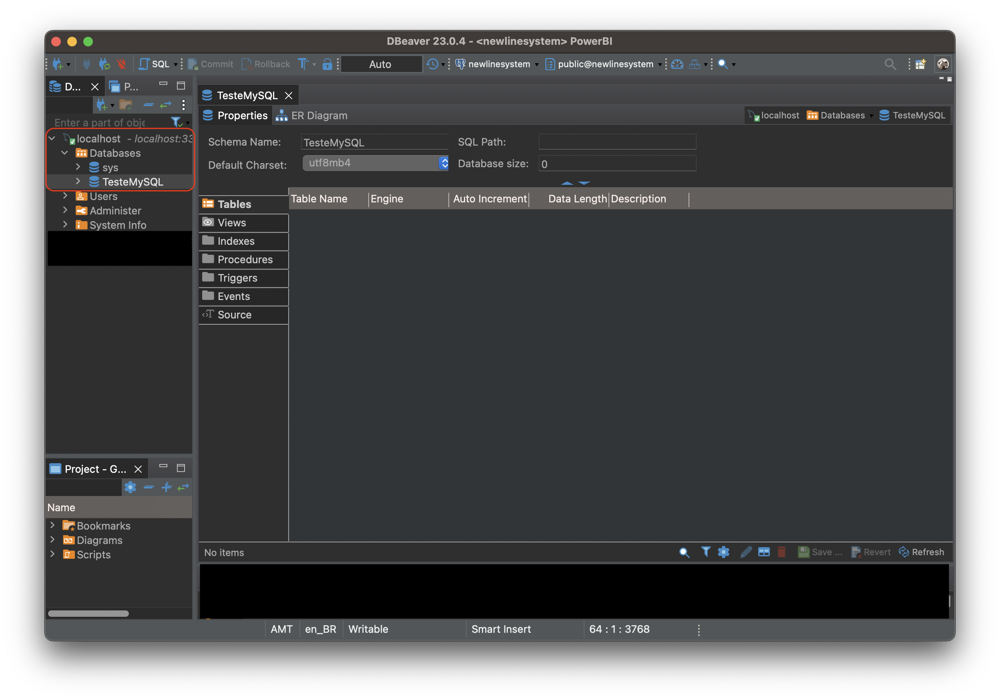

## macOS Mavericks - Databases

### Database Installation

There are native versions to install databases for your development, downloading directly from the database provider such as **MySQL** or **PostgreSQL**, or using **Docker** and even **XAMPP**. However, if you want something simple and quick, just for development and testing, try [DBngin](https://dbngin.com/).

It allows you to create instances of databases like **MySQL**, **PostgreSQL**, and **Redis**. It’s available for macOS and Windows, but unfortunately, there’s no version for Linux.

### Prerequisites

You need to have the following items installed on macOS:

- **DBngin**: Database service manager, download it [here](https://dbngin.com/).
- **DB Client**: For testing, I used [DBeaver Community](https://dbeaver.io/download/).

### 1. Installing

Download and open the DMG file, then drag DBngin to the Applications folder.

### 2. Creating a New Database Instance

* Open DBngin and click on the `+` icon. Note that if you have Homebrew installed, it allows you to start apps installed through it.

* Select the service you want (MySQL, PostgreSQL, or Redis), choose the version or keep the default (it always selects the latest version), and enter a service name, in my case, I named it MySqlServer.

**Note**: In this example, it automatically selected port 3306. You can change it if you wish, and below, it provides information that the user is root and there’s no password.

* Start or stop the service whenever you want.

You can create multiple MySQL services on different ports and use them according to your needs.

### 3. Use a Client to Manage/Test

For testing, I used **DBeaver Community**. I created a new connection on localhost, port 3306 (where I had created the service), user root, and no password.

I created a test database called TesteMySQL.

DBngin worked perfectly for my development and testing needs.

### 4. Final Considerations

For macOS, this is the easiest and fastest solution I found. I haven’t tested it on Windows yet, and for Linux, there’s XAMPP, although on Linux I typically install the database and deal with the usual *tedious* configurations, even for local development.

