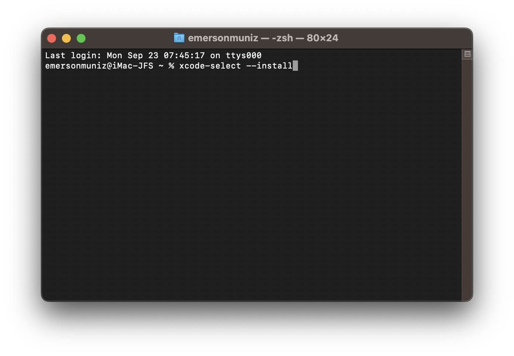
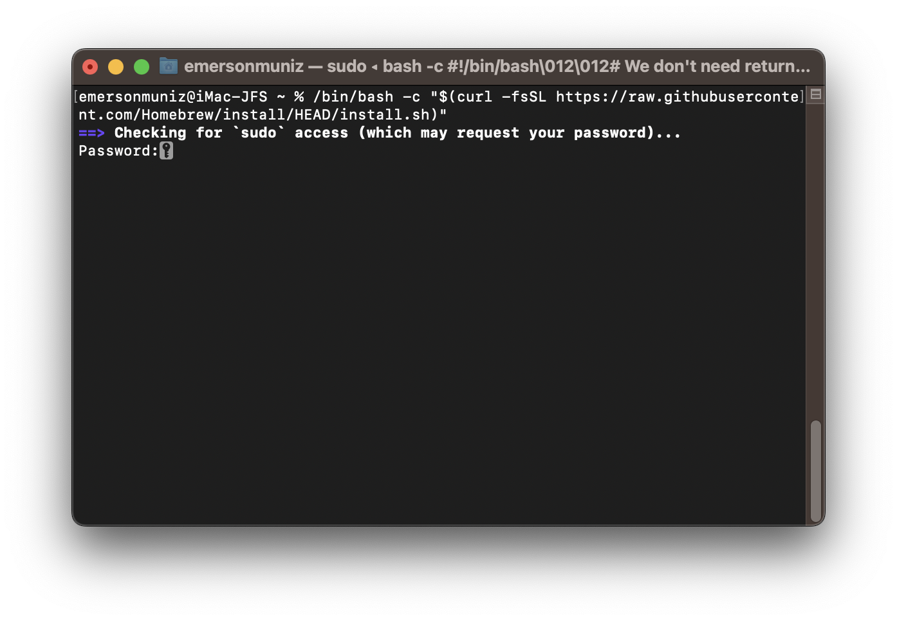
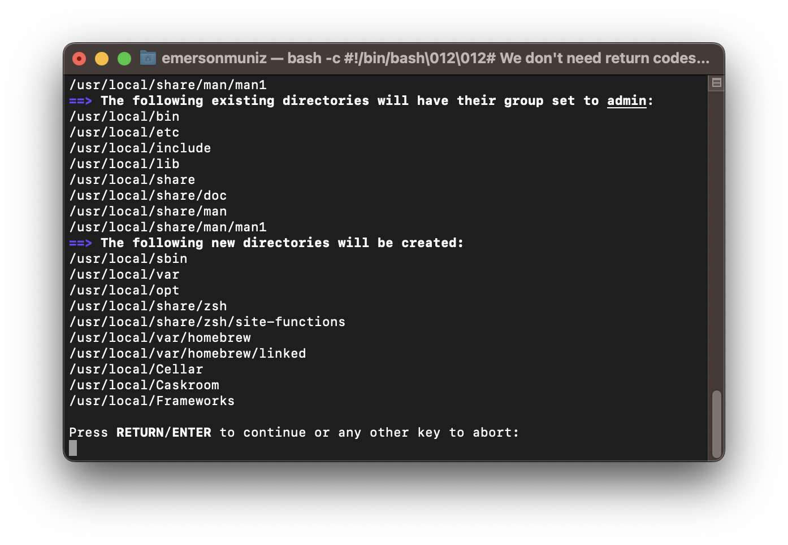
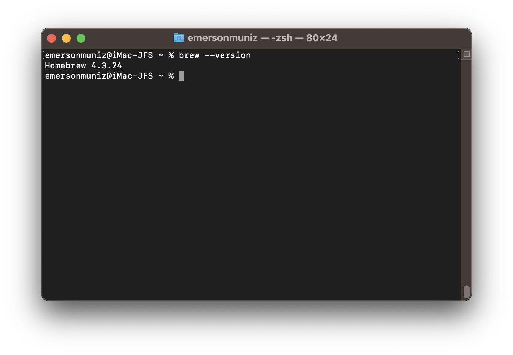
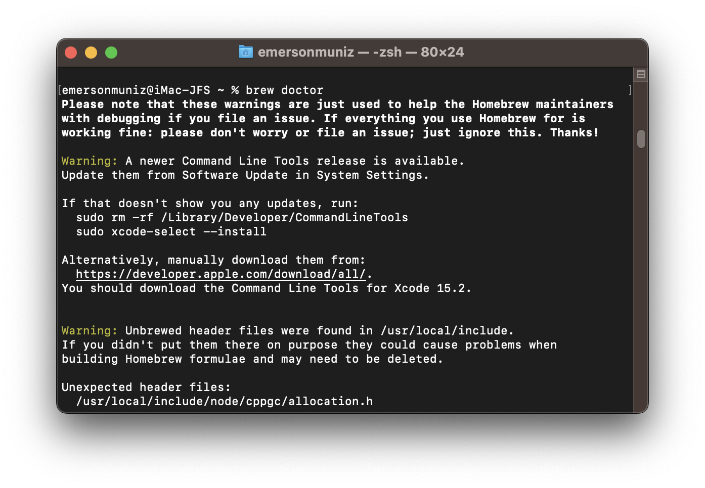

## How to Install Homebrew on macOS Mavericks

### Introduction

Homebrew is a package manager that provides an easy way to install and manage development tools, libraries, and software directly on macOS.

### Prerequisites

- A Mac running macOS.
- Access to the command terminal.
- Xcode Command Line Tools installed.

### Step 1: Install Xcode Command Line Tools

Before installing Homebrew, ensure that the Xcode command line tools are installed.

* Open **Terminal**.
* Run the command to install Xcode command line tools:

    ```bash
    xcode-select --install
    ```



* A window will appear asking if you want to install the tools. Click **Install** and follow the provided instructions.

### Step 2: Install Homebrew

With the command line tools installed, proceed with installing Homebrew.

* In the Terminal, run the command below to download and install Homebrew:

    ```bash
    /bin/bash -c "$(curl -fsSL https://raw.githubusercontent.com/Homebrew/install/HEAD/install.sh)"
    ```

* The installation script will ask for your administrator password. Enter it and press **ENTER**.



* Follow the instructions in the terminal. Homebrew will display what it’s about to execute, press **ENTER**.



* After installation, check the Homebrew version to ensure it installed correctly:

    ```bash
    brew --version
    ```



**Note:** If the version check command does not work, add Homebrew to the path (`PATH`) to ensure the commands work correctly. To do this, run the following in Terminal:

```bash
    echo 'export PATH="/usr/local/bin:$PATH"' >> ~/.bash_profile
    source ~/.bash_profile
```

### Step 3: Verify Homebrew Installation

Now, to ensure Homebrew is installed correctly, run the command:

```bash
brew doctor
```



### Step 4: Using Homebrew to Install Development Tools

With Homebrew installed, you can install various development tools with a single command. For example, you can install Git, Python, or even open-source frameworks and libraries.

### Example of Git installation:

```bash
brew install git
```

### Example of Python installation:

```bash
brew install python
```

### Step 5: Updating Homebrew

Homebrew makes it easy to update tools and packages.

* To update Homebrew:

    ```bash
    brew update
    ```

* To upgrade any installed tool (for example, Git):

    ```bash
    brew upgrade git
    ```

### Conclusion

With Homebrew installed on macOS, you'll have access to a wide range of development tools quickly and efficiently. Now you can set up your development environment and start working on your projects!
