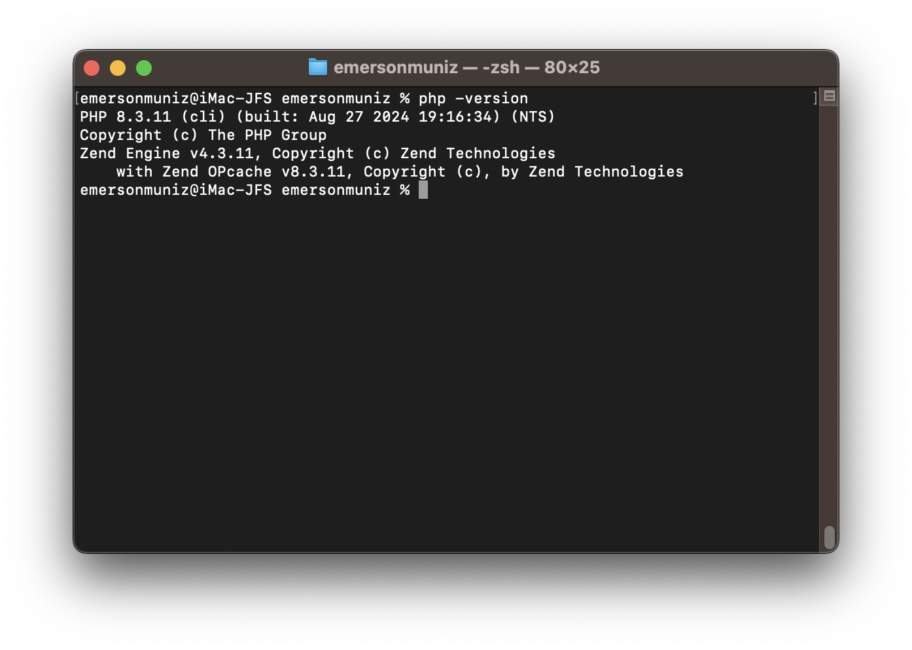
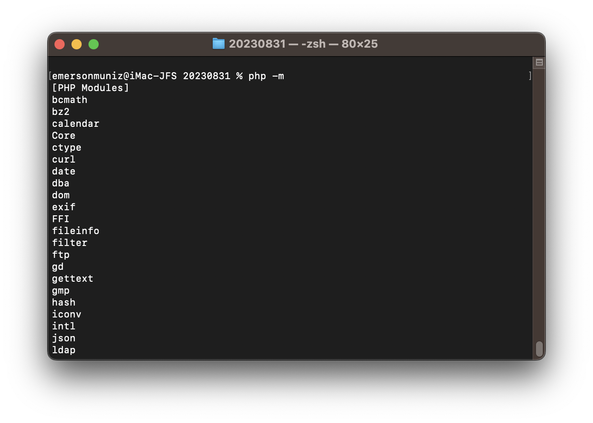
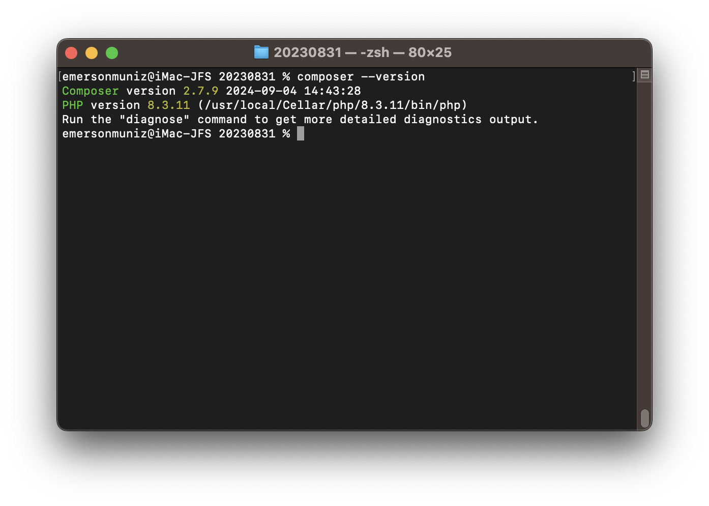
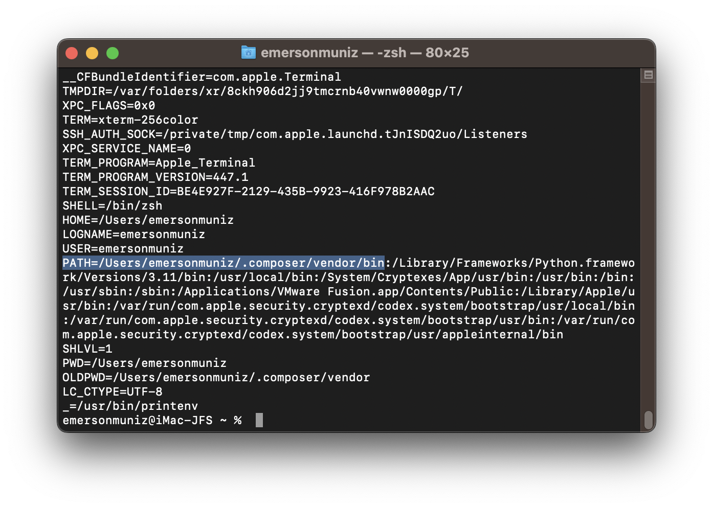
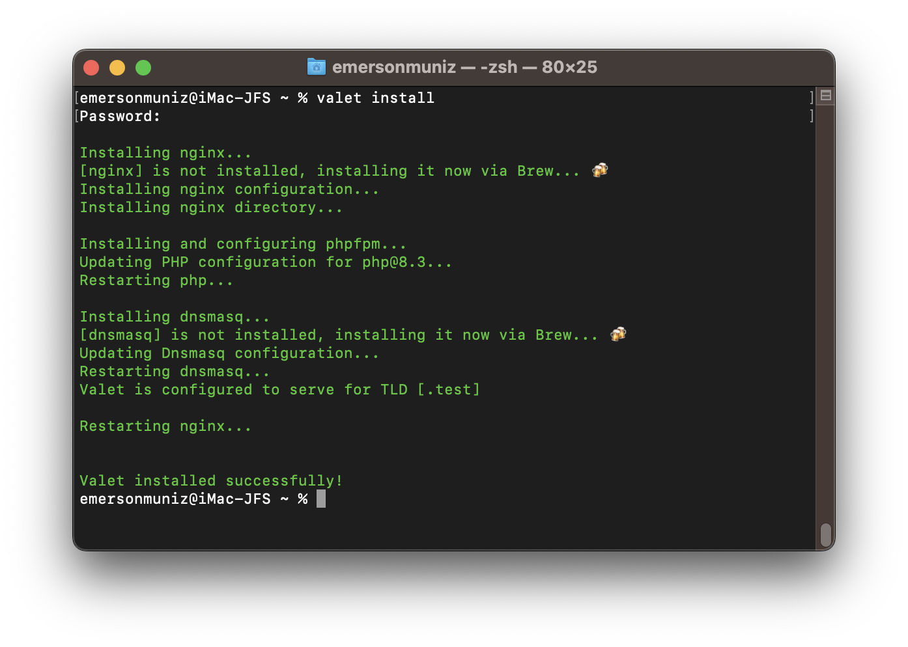
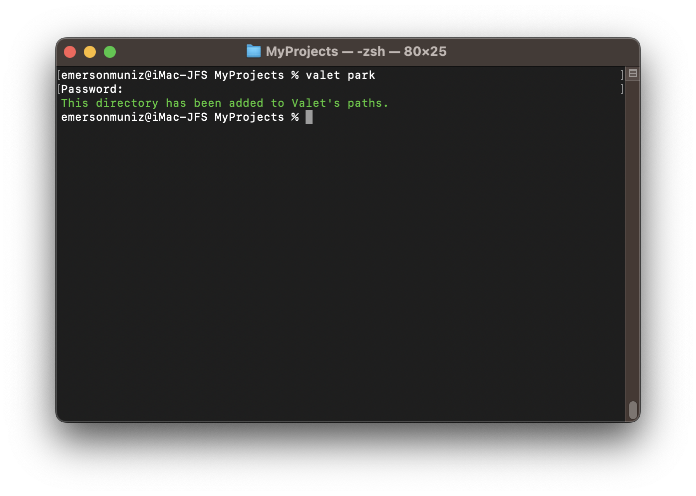
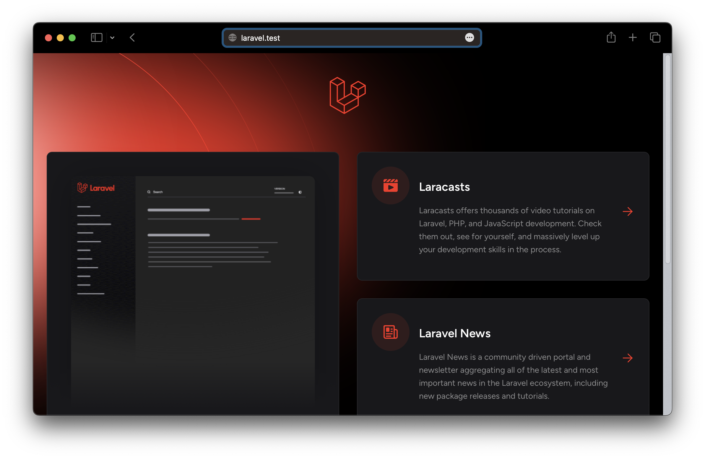

## macOS Mavericks - PHP and Laravel

### Installing and Configuring Laravel Valet to Run PHP, Laravel

Versions of macOS above Mavericks have made it more complicated to enable PHP on Apache, resulting in more tasks. We'll use a simpler and faster solution, remembering that **Docker** and even **XAMPP** are also available.

**Laravel Valet** is an excellent option for local PHP development: simple, lightweight, and efficient.

In this article, we will install and configure **Laravel Valet** to run **PHP**, **Laravel** (*something I’m going to study*), and **Adianti Framework** (*Yes, I use it and find it very good*).

### Prerequisites

You need to have the following items installed on macOS:

- **Homebrew**: A package manager for macOS.
- **PHP**: Installed via Homebrew.
- **Composer**: PHP dependency manager.

If you don’t have these components installed, we will install them step by step.

### 1. Installing Homebrew

If you don’t have Homebrew installed, refer to the article [macOS Mavericks - Installing Homebrew](https://github.com/emersonmuniz/emersonmuniz/tree/main/artigos/macos-mavericks-homebrew).

If you already have it, update Homebrew:

```bash
brew update
```

### 2. Installing PHP

Install PHP using Homebrew:

```bash
brew install php
```

Check if PHP was installed correctly:

```bash
php -version
```



If you want to see the loaded modules, the default installation via Brew includes all the ones I currently need:

```bash
php -m
```



### 3. Installing Composer

**Composer** is PHP’s dependency manager, required for Laravel and other projects.

To install Composer, run:

```bash
brew install composer
```

Check if Composer is installed correctly:

```bash
composer --version
```



### 4. Installing Laravel Valet

With PHP and Composer set up, install Laravel Valet.

* Install Valet via Composer:

```bash
composer global require laravel/valet
```

* Check if Composer is in your `PATH` (Environment Variable):

```bash
printenv
```



* If it’s not found, add Composer to your `PATH`:

```bash
export PATH="$HOME/.composer/vendor/bin:$PATH"
```

* Install Laravel Valet:

```bash
valet install
```



Valet is installed. It automatically uses **Nginx** and is ready to serve your web applications.

### 5. Configuring Valet

The next step is to configure the folders where you want to host your projects. If you don’t have a specific one, create a folder to store your PHP projects and point it to Valet.

* Create the folder where you want to store your projects (example: `~/Projects`):

```bash
mkdir ~/Projects
```

* Navigate to this folder and “**park**” it in Valet. All subfolders will be available automatically:

```bash
cd ~/Projects
valet park
```



In my specific case (*image above*), I’m using my "MyProjects" folder in Google Drive.

Now, any project you create within this folder will automatically be served under the `.test` domain. For example, if you create a folder named `my-project`, you can access it at `http://my-project.test`.

### 6. Installing Laravel

With Valet configured, you can easily create and serve Laravel projects. To create a new Laravel project, use Composer:

```bash
cd ~/Projects
composer create-project --prefer-dist laravel/laravel my-project
```

You can now access Laravel at `http://my-project.test`.



In my specific test, I created a Laravel folder/project (*composer create-project --prefer-dist laravel/laravel laravel*) and simply tested in the browser using laravel.test (*image above*).

### 7. Final Considerations

Now we have **Laravel Valet** configured to run PHP for local development.
