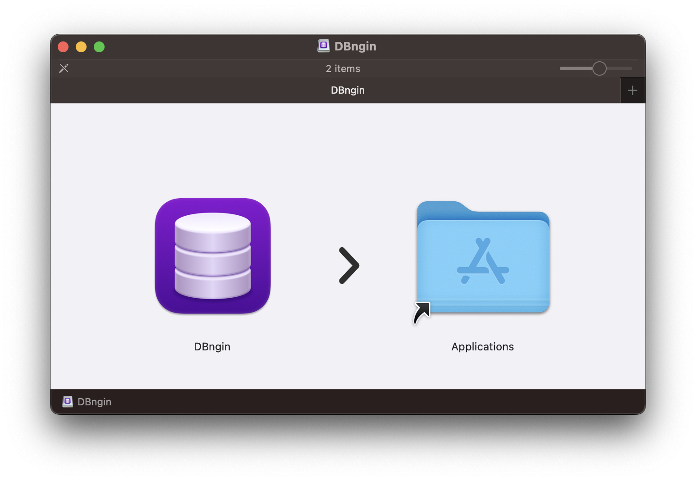
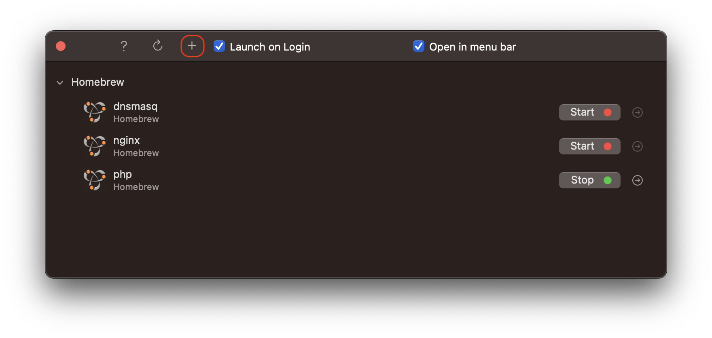
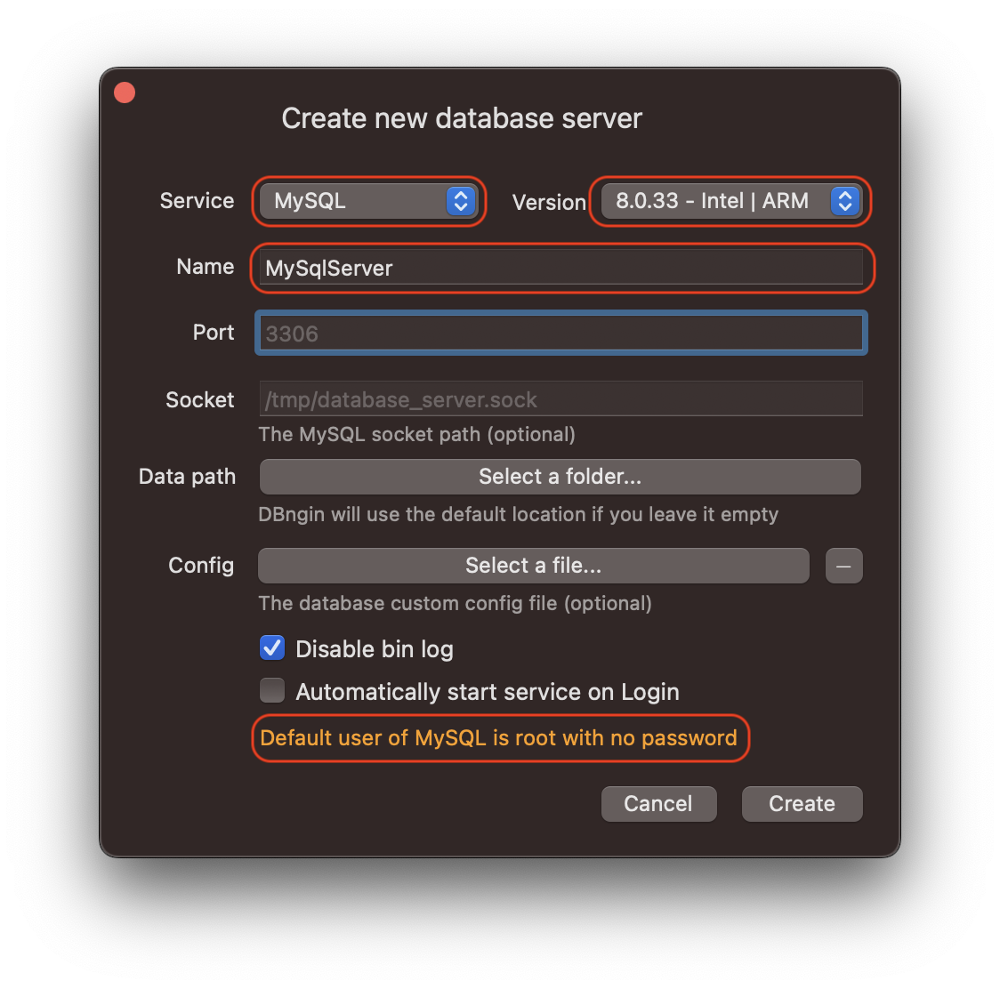
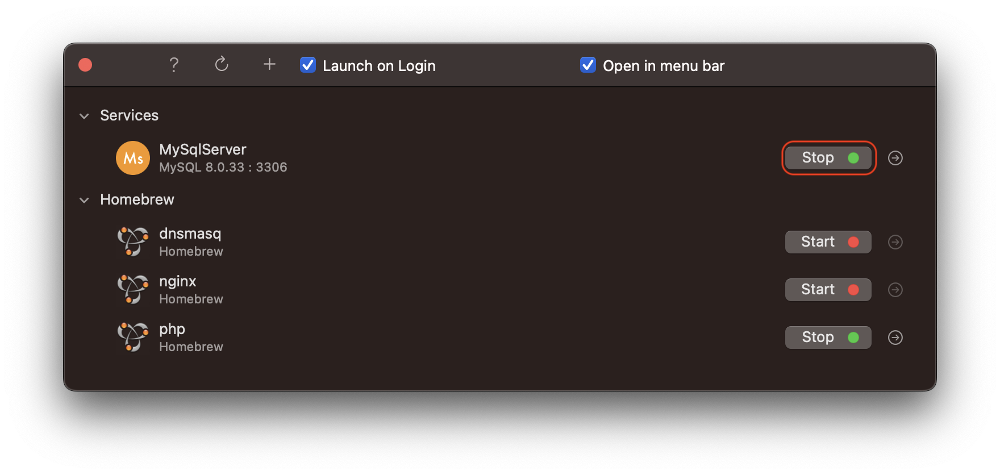
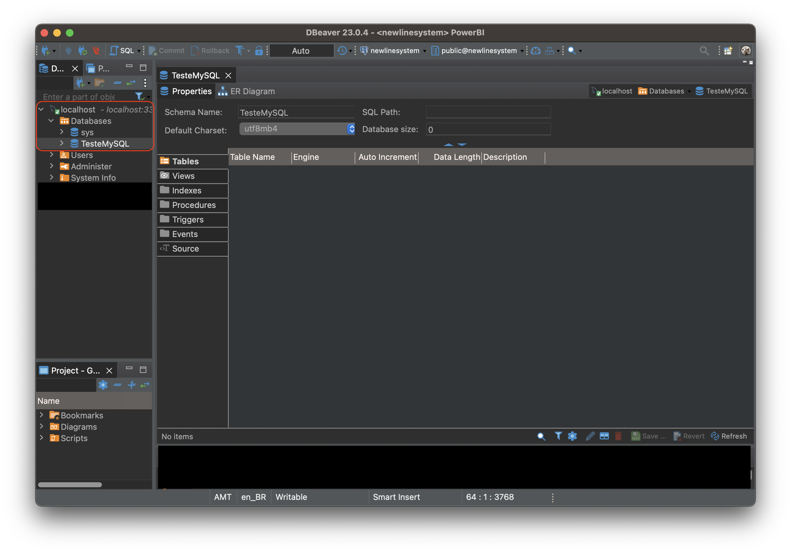

## macOS Mavericks - Bancos de Dados

### Instalação de Bancos de Dados

Existem versões nativas para instalar bancos de dados para o seu desenvolvimento, baixando direto do fornecedor do banco de dados **MySQL** ou **PostgreSQL** por exemplo ou usando **Docker** e até mesmo o **XAMMP**, mas se você quer algo simples, rápido, somente para desenvolvimento e testes, conheça o [DBngin](https://dbngin.com/).

Ele permite criar instancias dos bancos de dados **MySQL**, **PostgreSQL**, **Redis** por exemplo. Está disponivel para macOS e Windows, infelizmente nao tem para Linux.

### Pré-requisitos

Você precisa ter os seguintes itens instalados no macOS:

- **DBngin**: Gerenciador de serviços de banco de dados, baixe [aqui](https://dbngin.com/).
- **Cliente DB**: No meu caso para teste usei o [DBeaver Community](https://dbeaver.io/download/).

### 1. Instalando.

Baixe e abra o arquivo DMG, e arraste o DBngin para a pasta Aplicações.

### 2. Criando uma nova instãncia de banco de dados.

* Abra o DBngin e clique no `+`. Note que caso tenha o Homebrew instalado ele permite iniciar o para aplicativos instalados por ele.

* Selecione o serviço que deseja (MySQL, PostgreSQL ou Redis), escolha a versão ou mantenha ( ele sempre deixa a atual ), digite um nome de serviço, no meu caso coloque MySqlServer.

**Nota**: Ele já assumiu neste exemplo a porta 3306, pode alterar se desejar, e dá informaçòes abaixo que o usuário é root e não tem senha.

* Inicie ou pare o serviço quando desejar.

Voce pode criar varios servicos de MySQL por exemplo em portas diferentes e usar conforme sua necessidade.

### 3. Use um cliente para gerenciar/testar.

No meu caso estou usando o **DBeaver Community** para testar o serviço. Criei uma nova conexão no localhost, porta 3306 ( que eu havia criado o serviço), usuário root, sem senha.

Criei um banco TesteMySQL para testes.

Funcinou perfeitamente o DBngin para a minha finalidade de desenvolvimento e testes.

### 4. Considerações Finais

Para macOS é a mais fácil e rápida solução que encontrei, no Windows não testei ainda, e para Linux existe o XAAMP, embora no Linux eu normalmente faço a instalação normal do banco de dados e configuraçòes *chatas* habituais, mesmo para desenvolvimento local.

