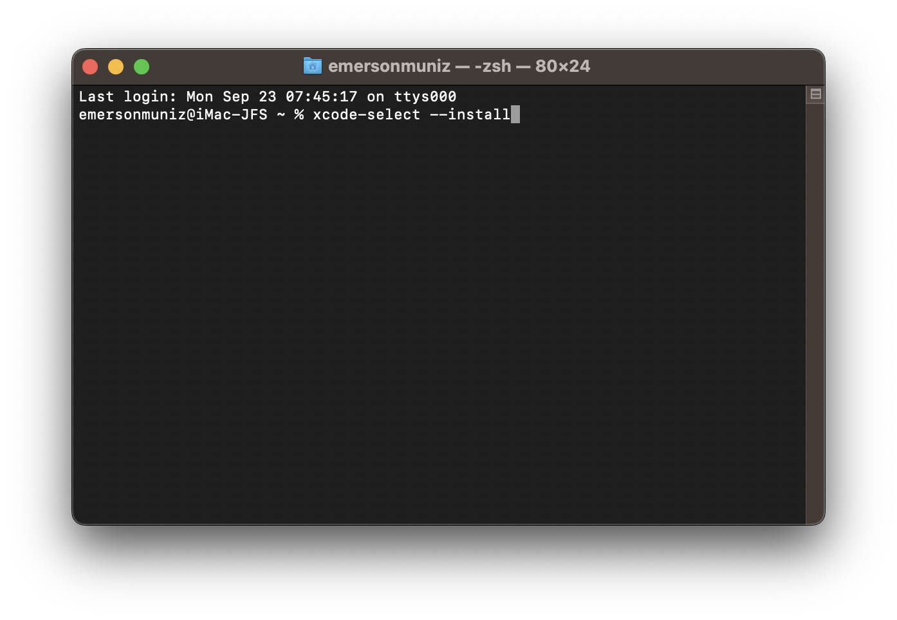
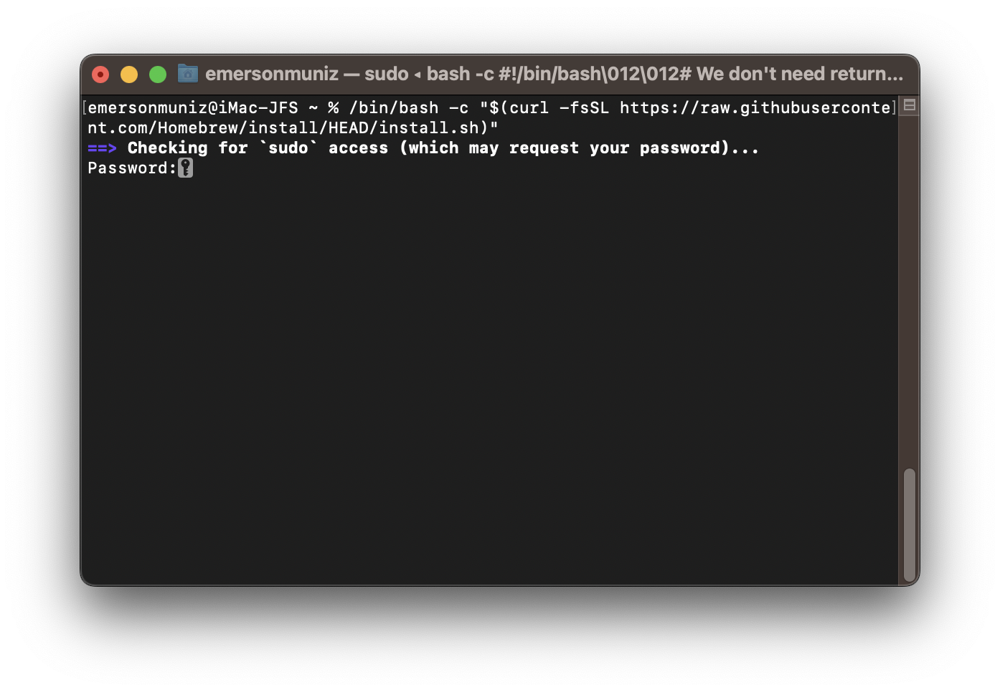
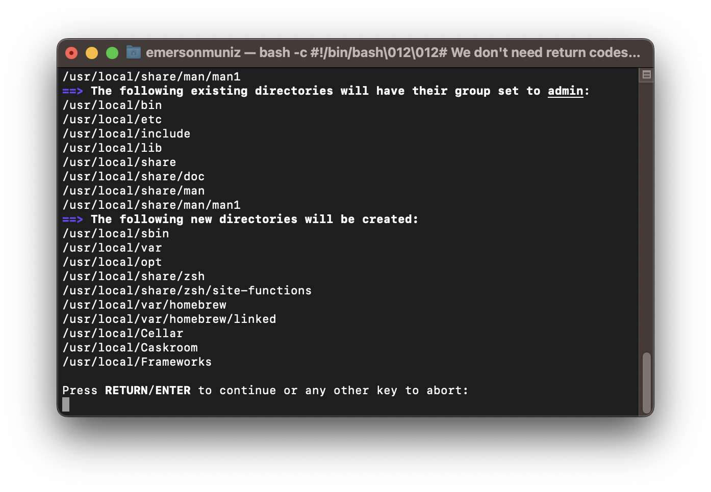
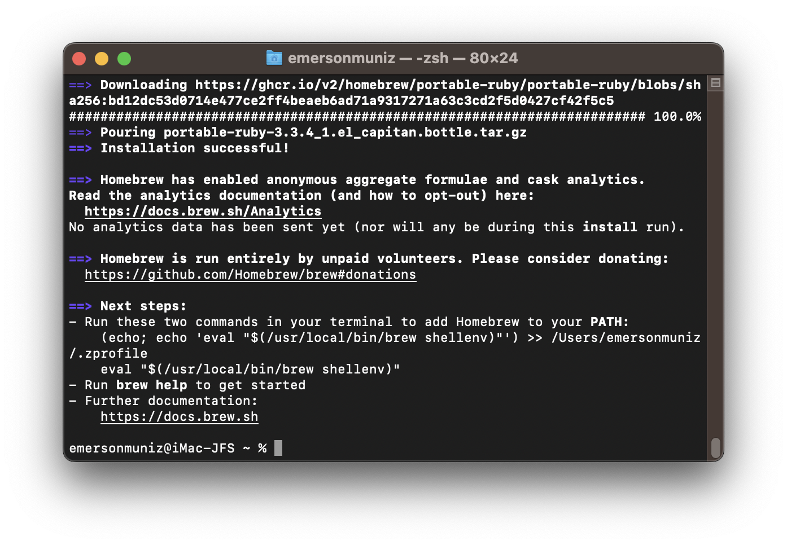
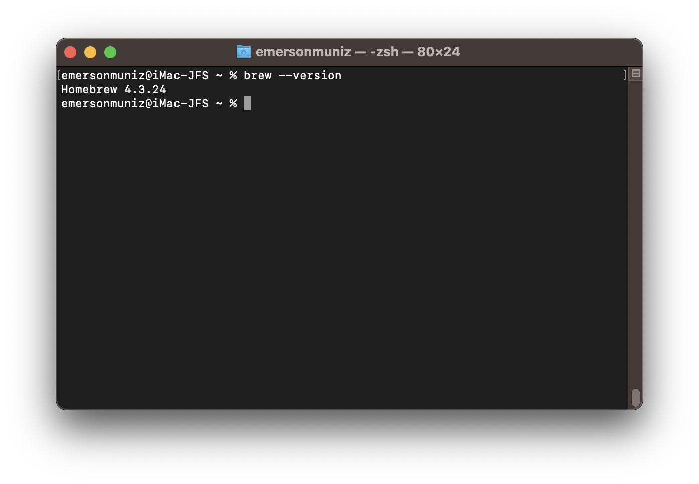
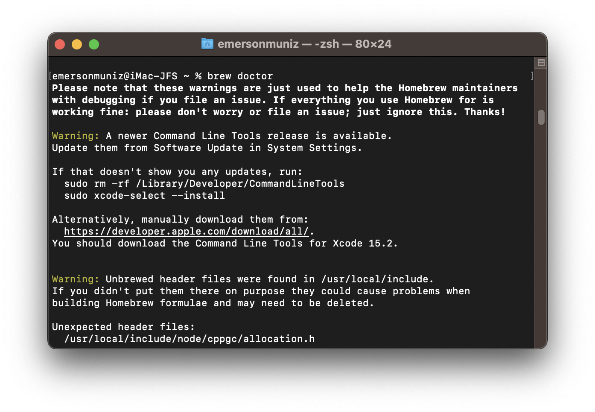

# macOS Mavericks - Instalando Homebrew

## Como Instalar o Homebrew no macOS Mavericks

### Introdução

O Homebrew é um gerenciador de pacotes, oferece uma maneira fácil de instalar e gerenciar ferramentas de desenvolvimento, bibliotecas e softwares diretamente nos sistemas operacionais.

### Pré-requisitos

- Um Mac com macOS.
- Acesso ao terminal de comando.
- Xcode Command Line Tools instalado.

### Passo 1: Instalar Xcode Command Line Tools

Antes de instalar o Homebrew, é necessário garantir que as ferramentas de linha de comando do Xcode estejam instaladas.

1. Abra o **Terminal**.
2. Execute o comando para instalar as ferramentas de linha de comando do Xcode:
    
    ```bash
    xcode-select --install
    
    ```



3. Uma janela aparecerá perguntando se você deseja instalar as ferramentas. Clique em **Instalar** e siga as instruções fornecidas.

### Passo 2: Instalar o Homebrew

Com as ferramentas de linha de comando instaladas, vamos proceder com a instalação do Homebrew.

1. No Terminal, execute o comando abaixo para baixar e instalar o Homebrew:
    
    ```bash
    /bin/bash -c "$(curl -fsSL https://raw.githubusercontent.com/Homebrew/install/HEAD/install.sh)"
    
    ```
    
2. O script de instalação solicitará a sua senha de administrador. Insira-a e pressione Enter.
3. Siga as instruções no terminal. O Homebrew irá mostrar o que irá executar, precione a tecla **ENTER**.
4. Após a instalação, verifique a versão do HomeBrew para garantir que está correta a instalação.
    
    ```bash
    brew --version
    
    ```










**Nota:** Caso o comando para verificar a versão instalada não funcionar, adicione o Homebrew ao caminho (`PATH`) para garantir que os comandos funcionem corretamente. Para fazer isso, execute no Terminal:

    
```bash
    echo 'export PATH="/usr/local/bin:$PATH"' >> ~/.bash_profile
    source ~/.bash_profile
    
```

### Passo 3: Verificar a Instalação do Homebrew

Agora, para garantir que o Homebrew está instalado com sucesso, execute o comando:

```bash
brew doctor

```




### Passo 4: Utilizando o Homebrew para Instalar Ferramentas de Desenvolvimento

Com o Homebrew instalado, você pode instalar diversas ferramentas de desenvolvimento com um único comando. Por exemplo, você pode instalar o Git, Python, ou até mesmo frameworks e bibliotecas de código aberto.

### Exemplo de instalação do Git:

```bash
brew install git

```

### Exemplo de instalação do Python:

```bash
brew install python

```

### Passo 5: Atualizando o Homebrew

O Homebrew facilita a atualização de ferramentas e pacotes.

1. Para atualizar o Homebrew:
    
    ```bash
    brew update
    
    ```
    
2. Para atualizar qualquer ferramenta instalada (por exemplo, o Git):
    
    ```bash
    brew upgrade git
    
    ```
    

### Conclusão

Com o Homebrew instalado no macOS, você terá acesso a uma infinidade de ferramentas de desenvolvimento de forma rápida e eficiente. Agora você pode configurar seu ambiente de desenvolvimento e começar a trabalhar em seus projetos!
