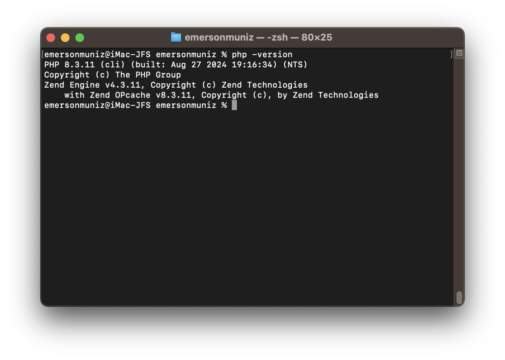
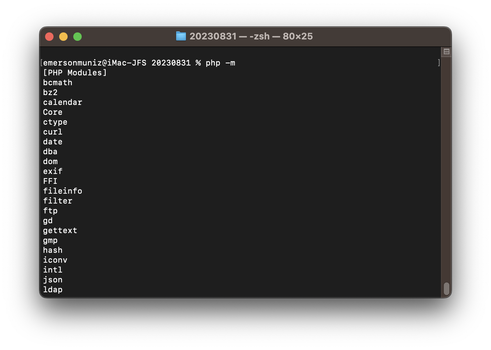
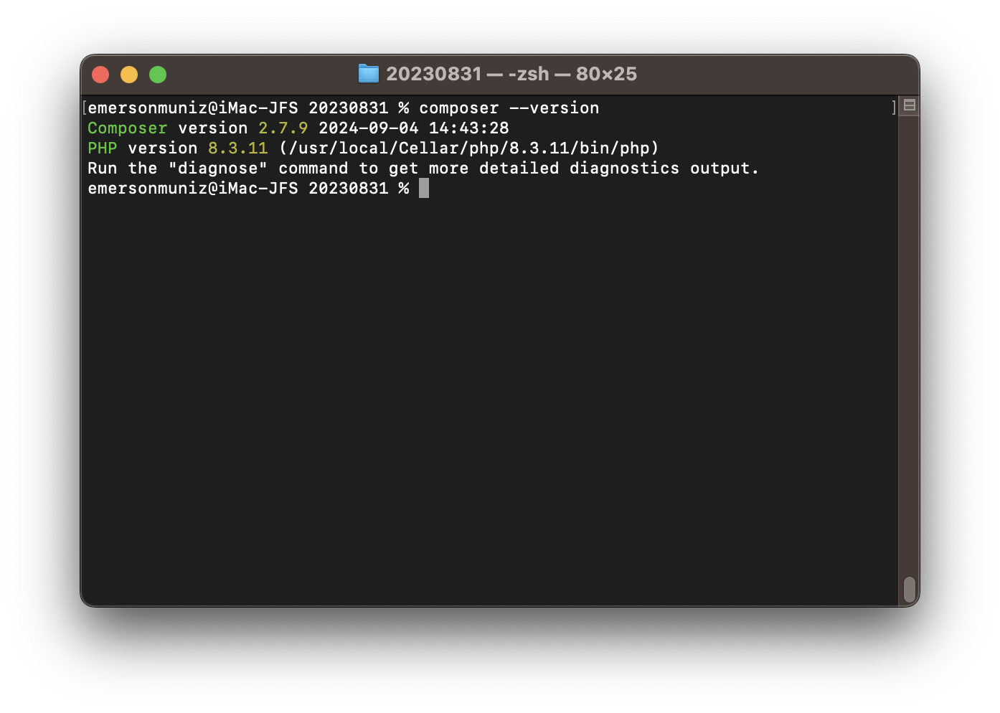
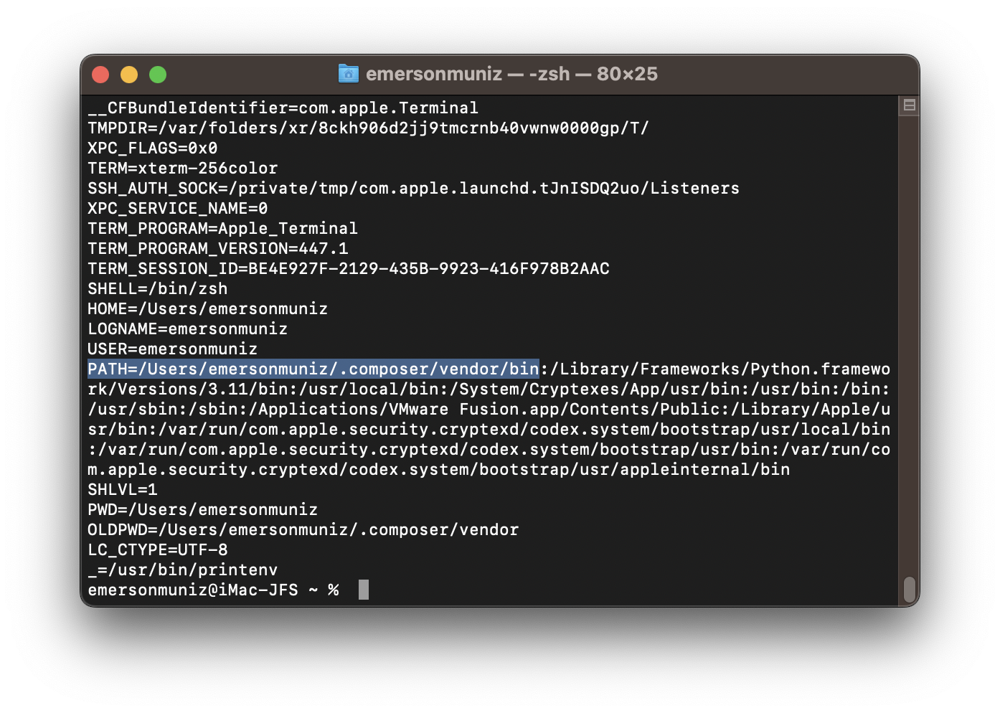
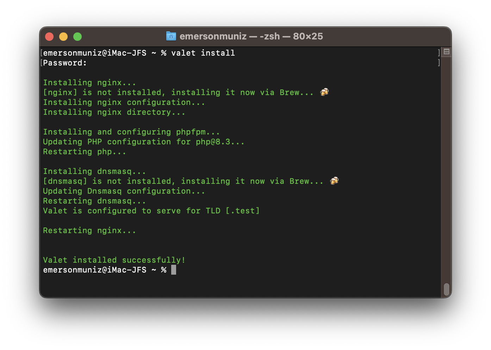
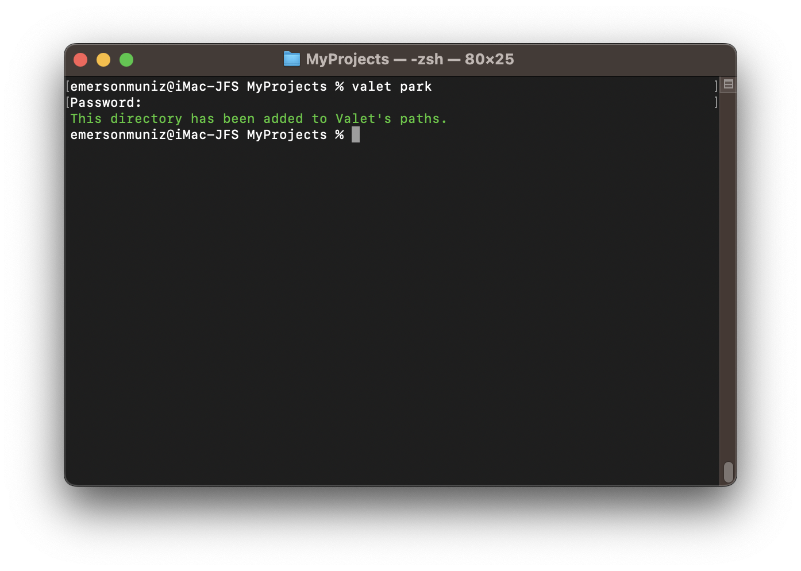
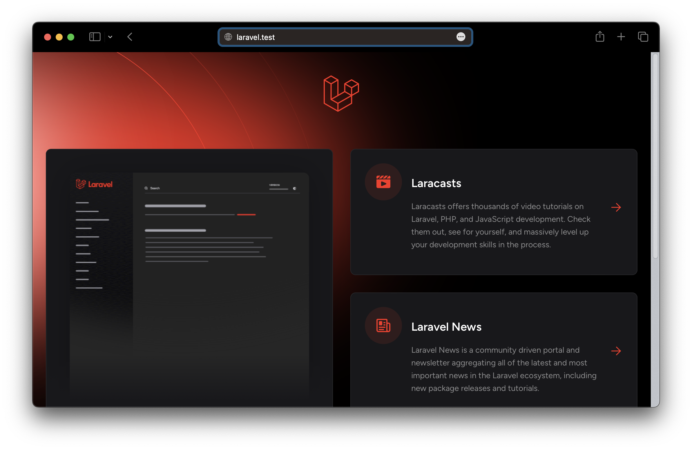

### Instalação e Configuração do Laravel Valet para Rodar PHP, Laravel

Versões do macOS Mavericks acima estão mais complicadas para conseguir habilitar o PHP no Apache, gerando mais tarefas, vamos usar uma solução mais simples e rápida, lembrando que ainda existe o **Docker** e até mesmo o **XAMMP**.

**Laravel Valet** é uma excelente opção para desenvolvimento PHP localmente, simples, leve e eficiente.

Neste artigo, vamos instalar e configurar o **Laravel Valet** para rodar **PHP**, **Laravel** (*vou estudar*), **Adianti Framework** (*Sim, eu uso e acha muito bom*).

### Pré-requisitos

Você precisa ter os seguintes itens instalados no macOS:

- **Homebrew**: Gerenciador de pacotes para macOS.
- **PHP**: Instalado através do Homebrew.
- **Composer**: Gerenciador de dependências do PHP.

Caso não tenha esses componentes, vamos instalando na sequência.

### 1. Instalando o Homebrew

Caso não tenho o HomeBrew ainda instalado, utilize o artigo [macOS Mavericks - Instalando Homebrew](https://github.com/emersonmuniz/emersonmuniz/tree/main/artigos/macos-mavericks-homebrew):

Caso tenha, atualize o HomeBrew:

```bash
brew update
```

### 2. Instalando o PHP.

Instale o PHP usando o Homebrew:

```bash
brew install php
```

Verifique se o PHP foi instalado corretamente:

```bash
php -version
```




Caso queira ver os módulos carregados, na instalação padrão pelo Brew vem todas que preciso atualmente:

```bash
php -m
```




### 3. Instalando o Composer

O **Composer** é o gerenciador de dependências do PHP, necessário para Laravel dentre outros.

Para instalar o Composer, execute:

```bash
brew install composer
```

Verifique se o Composer está instalado corretamente:

```bash
composer --version
```


### 4. Instalando o Laravel Valet

Com o PHP e o Composer configurados, instale o Laravel Valet.

* Instale o Valet via Composer:

```bash
composer global require laravel/valet
```

* Verifique se o composer esta no seu `PATH` (Variável de Ambiente):

```bash
printenv
```



* Caso não encontre, adicione o Composer ao seu `PATH`:

```bash
export PATH="$HOME/.composer/vendor/bin:$PATH"
```

* Instale o Laravel Valet:

```bash
valet install

```




Valet instalado, ele automaticamente usa o **Nginx** e está pronto para servir suas aplicações Web.

### 5. Configurando o Valet

O próximo passo é configurar as pastas onde você deseja hospedar seus projetos. Caso não tenha uma especifica, crie uma pasta para armazenar os projetos PHP e apontá-la no Valet.

* Crie a pasta onde deseja armazenar seus projetos (exemplo: `~/Projetos`):

```bash
mkdir ~/Projetos
```

* Navegue até essa pasta e "**parque**" ela no Valet, todas as subpastas serão disponíveis automaticamente:

```bash
cd ~/Projetos
valet park
```



No meu caso especifico (*imagem acima*) estou usando minha pasta "MyProjects" do Google Drive.

Agora, qualquer projeto que você criar dentro dessa pasta será automaticamente servido no domínio `.test`. Por exemplo, se você criar uma pasta `meu-projeto`, poderá acessar o projeto em `http://meu-projeto.test`.

### 6. Instalando o Laravel

Com o Valet configurado, você pode criar e servir projetos Laravel facilmente. Para criar um novo projeto Laravel, use o Composer:

```bash
cd ~/Projetos
composer create-project --prefer-dist laravel/laravel meu-projeto
```

Agora, você pode acessar o Laravel em `http://meu-projeto.test`.



No meu caso especifico para teste criei uma pasta/projeto laravel ( *composer create-project --prefer-dist laravel/laravel laravel* ) e no browser simplesmente testei com laravel.test ( *imagem acima* ).

### 7. Considerações Finais

Agora temos o **Laravel Valet** configurado para rodar PHP para desenvolvimento local.

